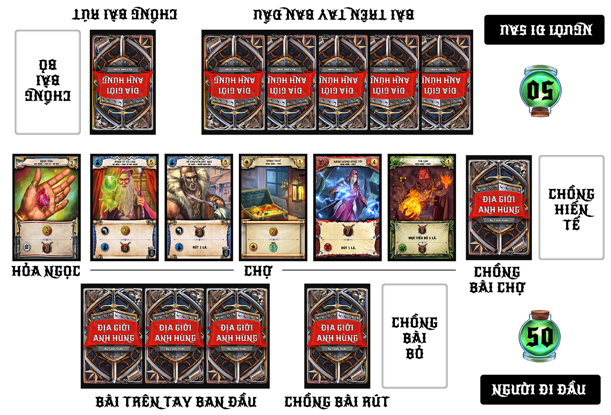

# GIỚI THIỆU

Hàng thiên niên kỷ, địa giới chìm trong chiến tranh. Nhờ liên hợp với tộc Rồng, Quân Đội Đế Chế đã giành nhiều chiến thắng liên tiếp. Nhưng những thế lực khổng lồ khác đã nổi lên... địa giới lại loạn lạc.

Ở Địa Giới Anh Hùng, bạn là người hùng lãnh đạo các anh hùng để thống nhất địa giới. Bạn phải dùng tài năng và mưu lược của mình để chiêu mộ các anh hùng và giành chiến thắng trước đối thủ.

## Thành Phần:
### 148 lá bài:
 - 4 lá Tài Liệu
 - 64 lá Cơ Bản
   + 16 lá Hỏa Ngọc
   + 8 lá Ghi Máu (2 lá/người chơi)
   + 28 lá Vàng (7 lá/người chơi)
   + 4 lá Kiếm Ngắn (1 lá/người chơi)
   + 4 lá Dao Găm (1 lá/người chơi)
   + 4 lá Hồng Ngọc (1 lá/người chơi)
 - 80 lá Chợ

    Quân Đế Chế (20 lá)
   + Rồng Đế Quốc
   + Đội Hình Cận Chiến
   + Ra Lệnh
   + Cristov Chính Nghĩa
   + Pháp Sĩ Chuyên Chiến
   + Sự Thống Trị
   + Tu Sĩ Cao Cấp
   + Kỵ Binh Hạng Nặng (2)
   + Thầy Duy Diêm
   + Củng Cố Binh Lực
   + Chiêu Mộ (3)
   + Đánh Thuế (3)
   + Tư Sĩ Thập Phần (2)
   + Lời Nói Quyền Lực

    Quân Liên Hợp (20 lá)
   + Quỷ Tinh Đánh Thuê
   + Hối Lộ (3)
   + Cảnh Cáo
   + Trò Bịp
   + Bom Lửa
   + Thủ Tiêu (2)
   + Đe Dọa
   + Pháp Sĩ Tối Cao
   + Lợi Nhuận (3)
   + Vua Sát Thủ
   + Kẻ Buôn Lậu
   + Kẻ Chuyên Bắt Nạt
   + Đập Nát và Cướp
   + Cướp Đường Phố (2)

    Quân Ác Ma (20 lá)
   + Thầy Tăng (2)
   + Năng Lượng Bóng Tối
   + Phẩn Thưởng Bóng Tối
   + Giáo Đầu Tử Thần (2)
   + Bàn Tay Tử Thần (3)
   + Uy Lực (3)
   + Bá Tước Ma Cà Rồng
   + Hút Sinh Lực 
   + Vô Hình
   + Pháp Sư Lạc Lối
   + Thôi Rửa (2)
   + Chúa Quỷ
   + Thầy Đồng

    Quân Hoang Dã (20 lá)
   + Thơ Dệt Truyền Thuyết
   + Đấu Sĩ Cron
   + Sói Hung Bạo
   + Lời Nguyền Yêu Tinh (2) 
   + Món Quà Yêu Tinh (3)
   + Thiên Lôi Đại Quỷ
   + Món Quà Thiên Nhiên
   + Quỷ Hạ Đẳng (2)
   + Hung Hăng
   + Khổng Lồ Đá
   + Tia Lửa (3)
   + Dạng Sói
   + Lang Pháp Sư (2)

Mỗi người chơi sẽ bắt đầu với chồng bài riêng của mình, tượng trưng cho tài nguyên, trang bị, hành động và Đệ Nhất. Mỗi lượt, bạn sẽ chơi tất cả lá trên tay để thu thập Vàng, Sát Thương, Máu, và những hiệu ứng khác.

Vàng () được dùng mua bài từ chợ, bổ sung vào bộ bài của bạn. Những lá này tượng trưng cho những hành động bạn có thể thực hiện và Đệ Nhất bạn có thể chiêu mộ về phe bạn.

Sát Thương () được dùng để tấn công đối thủ hoặc Đệ Nhất của đối thủ.

Máu () là điểm của bạn. Mỗi người chơi bắt đầu với 50 máu. Khi máu người chơi tiến về 0, người đó bị loại. Người còn sống cuối cùng sẽ giành chiến thắng.

# CHUẨN BỊ

Để bắt đầu trò chơi, xào Chồng Bài Chợ và đặt úp ở giữa bàn. Sau đó, mở 5 lá trên cùng Chồng Bài Chợ tạo thành một hàng kế bên Chồng Bài Chợ. Những lá mở ra tạo thành Chợ.

Kế lá cuối cùng của Chợ, đặt mở chồng Hỏa Ngọc thành một chồng riêng. Cuối cùng, chừa một chỗ trống dành cho Chồng Hiến Tế.

Mỗi người chơi xào chồng bài riêng của mình và đặt úp trước mặt. Chừa một vùng trống kế bên dành cho chồng bài bỏ.

Ngẫu nhiên quyết định người đi trước. Người đó rút 3 lá (người chơi luôn rút bài từ chồng bài riêng của mình). Người chơi đi sau rút 5 lá.

 

# CÁCH CHƠI

Mỗi người chơi sẽ đi theo lượt. Bắt đầu từ người đầu tiên, lượt chơi đi theo chiều kim đồng hồ. Mỗi lượt có ba giai đoạn:

+ Giai Đoạn Chính
+ Giai Đoạn Bỏ Bài
+ Giai Đoạn Rút Bài

### __**Giai Đoạn Chính**__

Trong Giai Đoạn Chính của bạn, bạn có thể thực hiện bất kỳ hành động dưới, không phân biệt thứ tự và giới hạn số lần bạn thực hiện:
+ Đánh ra một lá trên tay.
+ Dùng kỹ năng Giới Hạn, Đồng Minh, và/hoặc Hiến Tế của bất kỳ lá của bạn đang nằm trong vùng chơi.
+ Dùng Vàng để đạt được lá mới từ Chợ.
+ Dùng Sát Thương để tấn công một đối thủ và/hoặc Đệ Nhất của họ.

### __**Đánh Ra**__
Đặt lá bài vào vùng chơi trước mặt bạn. Có ba loại bài bạn có thể có ở trong bộ bài của bạn: Hành Động, Vật Phẩm và Đệ Nhất.

### __**Hành Động và Vật Phẩm**__
Khi một Hành Động hoặc Vật Phẩm được đánh ra, kỹ năng cơ bản của lá đó sẽ kích hoạt ngay lập tức. Nếu Hành Động hoặc Vật Phẩm có kỹ năng Đồng Minh và/hoặc Hiến Tế, bạn có thể chọn dùng một hoặc cả hai kỹ năng này vào thời điểm bất kỳ trong Giai Đoạn Chính của bạn (cung cấp thông tin yêu cầu của kỹ năng cho mọi người trước khi kích hoạt kỹ năng).

Hành Động và Vật Phẩm được mở, đặt vào vùng chơi của bạn cho đến Giai Đoạn Bỏ Bài. Khi đó, chúng sẽ được đặt vào Chồng Bài Bỏ của bạn.

Tất cả lá bài đều có tên và loại bài (*Hành Động*, *Đệ Nhất*, *Vật Phẩm*). Nhiều lá sẽ có loại phụ. Tên, loại bài và loại phụ không ảnh hưởng trực tiếp đến trò chơi, nhưng một số lá sẽ dựa trên những cụm từ đó để thêm hiệu ứng.

### __**Đệ Nhất**__
Không giống với Hành Động và Vật Phẩm, Đệ Nhất không bị bỏ vào cuối lượt. Thay vào đó, chúng vẫn nằm trong vùng chơi của bạn cho đến khi bị gây choáng hoặc hiến tế.

Đệ Nhất tiến vào vùng chơi nằm theo hướng dọc (*Bày Binh*). Hầu hết các Đệ Nhất đều có kỹ năng Giới Hạn (). Để dùng kỹ năng Giới Hạn, xoay ngang lá bài để kích hoạt hiệu ứng sau kí hiệu; Bạn có thể thực hiện điều này ở thời điểm bất kỳ trong Giai Đoạn Chính.

Mỗi Đệ Nhất có chỉ số Phòng Thủ (bên trong khiên) thể hiện số Sát Thương mà nó có thể nhận được trong mỗi một lượt trước khi bị choáng. Khi bị choáng, Đệ Nhất được đặt vào chồng bài bỏ của người sở hữu. Sát Thương gây ra cho Đệ Nhất không cộng dồn ở những lượt khác nhau.

Một số Đệ Nhất là Hộ Vệ. Hộ Vệ có khiên màu đen với "từ Hộ Vệ" ở phía trên. Hộ Vệ được bày binh để bảo vệ bạn và các Đệ Nhất khác. Khi bạn có một Hộ Vệ được bày binh trong vùng chơi, bạn không thể bị tấn công, và những Đệ Nhất không phải Hộ Vệ không thể bị tấn công hay được chọn là mục tiêu cho đến khi tất cả Hộ Vệ bị gây choáng.

Ghi chú: Hộ Vệ chỉ bảo vệ người sở hữu và Đệ Nhất của người đó. Chúng không bảo vệ người chơi khác hay Đệ Nhất của người chơi khác, dù khi chơi ở dạng đồng đội.

### __**Dùng Kỹ Năng**__
Kỹ năng cơ bản của một Hành Động hoặc Vật Phẩm được dùng ngay lập tức khi chúng được đánh ra. Tất cả kỹ năng khác có thể được chơi ở thời điểm bất kỳ trong Giai Đoạn Chính của người chơi đó.

Nếu kỹ năng tạo ra Vàng hoặc Sát Thương, tài nguyên đó sẽ được đưa vào nguồn vốn - có thể dùng ở thời điểm bất kỳ trong Giai Đoạn Chính. Nếu kỹ năng hồi máu, lập tức tăng số máu của người chơi.

Một số kỹ năng cho phép bạn lựa chọn hiệu ứng. Hãy cho mọi người biết rõ hiệu ứng bạn chọn.

### __**Kỹ Năng Giới Hạn**__
Kỹ năng Giới Hạn được biểu hiện bởi kí hiệu  nằm trong khung chữ. Để dùng kỹ năng này, bạn xoay ngang lá bài. Bạn có thể dùng Kỹ Năng Giới Hạn của lá bài ở thời điểm bất kỳ trong Giai Đoạn Chính, bao gồm lượt bạn đánh ra lá có Kỹ Năng Giới Hạn.

Có một số lá cho phép bạn "bày binh" lại những lá khác trong lượt của bạn. Điều đó cho phép bạn dùng lại kỹ năng đó trong cùng lượt.

### __**Kỹ Năng Đồng Minh**__
Những kỹ năng này được xác định bởi biểu tượng quân trong khung chữ. Trong lượt của bạn, một Kỹ Năng Đồng Minh có thể dùng ngay khi bạn có lá khác cùng loại quân trong vùng chơi. Thứ tự bạn đánh ra không quan trọng. Ngay khi bạn có ít nhất hai lá cùng loại quân trong vùng chơi, bạn có thể kích hoạt tất cả Kỹ Năng Đồng Minh liên quan. Chúng có thể dùng ở thời điểm bất kỳ trong Giai Đoạn Chính của bạn, và mỗi kỹ năng chỉ được dùng một lần mỗi lượt.

### __**Kỹ Năng Hiến Tế**__
Một số lá có Kỹ Năng Hiến Tế được xác định bởi  trong khung chữ. Những kỹ năng này dùng để loại bỏ dư thừa. Khi một lá được hiến tế, đặt nó vào Chồng Hiến Tế. Nếu một lá được Hiến Tế không phải do Kỹ Năng Hiến Tế của nó, kỹ năng sẽ không được kích hoạt.

### __**Đạt Được**__
Một số kỹ năng tạo ra Vàng. Bạn có thể dùng Vàng trong nguồn vốn để đạt được những lá từ Chợ hoặc Chồng Hỏa Ngọc. Giá trị của lá bài nằm ở góc trên phải lá bài. Để đạt được lá bài, bạn trừ số Vàng trong nguồn vốn bằng với giá trị của lá bài và đặt lá đó vào chồng bài bỏ của bạn. Sau đó, lấp đầy chỗ còn trống trong Chợ bằng lá trên cùng Chồng Bài Chợ.

Đạt được một lá bài không tính là đánh ra nó, bạn không thể dùng kỹ năng khi đạt được nó. Vàng sẽ được lưu lại và bạn có thể đạt được thêm bài trong Giai Đoạn Chính.

### __**Tấn Công**__
Một số kỹ năng tạo ra Sát Thương. Bạn có thể dùng Sát Thương trong nguồn vốn để tấn công đối thủ và/hoặc Đệ Nhất của họ. Bạn có thể tấn công nhiều lần trong Giai Đoạn Chính của bạn.

Để tấn công Đệ Nhất, bạn trừ số Sát Thương trong nguồn vốn và Đệ Nhất đó nhận bấy nhiêu sát thương. Nếu Đệ Nhất nhận số sát thương trong lượt bằng hoặc lớn hơn chỉ số Phòng Thủ, bạn gây choáng Đệ Nhất và đặt nó vào chồng bài bỏ của người sở hữu.

Đôi khi kỹ năng lá bài ghi "Gây choáng một Đệ Nhất". Trong trường hợp này, bạn chọn và gây choáng một Đệ Nhất mà không cần phải dùng Sát Thương. (Bạn không thể chọn Đệ Nhất không phải Hộ Vệ nếu đối thủ có Hộ Vệ trong vùng chơi!)

Để tấn công đối thủ, trừ số Sát Thương từ nguồn vốn và hạ máu của đối thủ bấy nhiêu điểm. Đối thủ không thể bị tấn công nếu họ có Hộ Vệ trong vùng chơi. Bạn cần phải gây choáng Hộ Vệ trước khi bạn tấn công người chơi.

Ghi chú: Nhiều Đệ Nhất có Kỹ Năng Giới Hạn tạo ra Sát Thương. Sát Thương đó được đưa vào nguồn vốn; Đệ Nhất của bạn không tấn công trực tiếp Đệ Nhất khác.

### __**Giai Đoạn Bỏ Bài**__
Khi bạn bỏ một lá hoặc đạt một lá mới từ Chợ, đặt ngửa vào chồng bài bỏ. Người chơi bất kỳ có thể xem chồng bài bỏ của bạn. Trong Giai Đoạn Bỏ Bài, bạn phải làm những điều sau:
+ Mất tất cả Vàng còn lại trong nguồn vốn.
+ Mất tất cả Sát Thương còn lại trong nguồn vốn.
+ Đặt tất cả Hành Động và Vật Phẩm trong vùng chơi vào chồng bài bỏ.
+ Đặt tất cả lá còn lại trên tay vào chồng bài bỏ.
+ Bày binh tất cả Đệ Nhất của bạn.

### __**Giai Đoạn Rút Bài**__
Trong Giai Đoạn Rút Bài, bạn rút năm lá và sau đó kết thúc lượt.

Ghi chú: Nếu chồng bài của bạn hết và bạn cần rút hoặc mở lá mới từ chồng bài riêng của bạn ở một thời điểm bất kỳ trong lượt của bạn, bạn xào chồng bài bỏ và đặt nó úp tạo thành chồng bài mới.

# LUẬT CHƠI NHÓM
## Loạn Chiến (Số Người: 2+)
Ngẫu nhiên chọn một người đi trước, sau chơi tiếp tục theo chiều kim đồng hồ. Người chơi có thể tấn công bất kỳ người chơi khác. Người sống sót cuối cùng sẽ chiến thắng! Nếu có từ ba người trở lên, người đầu tiên bắt đầu với 3 lá trên tay, người thứ hai bắt đầu với 4 lá, và mỗi người chơi còn lại bắt đầu với 5 lá.
## Săn Đuổi - Người Đầu Tiên (Số Người: 3+)
Gần giống với Loạn Chiến, tuy nhiên mỗi người chơi chỉ có thể tấn công hay chọn người bên trái, và chỉ có thể tấn công hay Đệ Nhất của người chơi bên cạnh (trái và phải). Người đầu tiên bắt đầu với 3 lá trên tay, người thứ hai bắt đầu với 4 lá, và mỗi người chơi còn lại bắt đầu với 5 lá. Trò chơi kết thúc khi có một người chơi bị loại; người bên phải người bị loại sẽ là người chiến thắng.

## Săn Đuổi - Người Sống Sót Cuối Cùng (Số người: 3+)
Gần giống với Săn Đuổi - Người Đầu Tiên, tuy nhiên trò chơi không kết thúc khi một người chơi bị loại. Người bên phải người bị loại hồi 10 máu và rút 1 lá. Người sống sót cuối cùng sẽ giành chiến thắng!

## Song Đấu (4 Người, 2 Người/Đội)
Mỗi đội bắt đầu 75 máu. Tất cả người chơi cùng một đội chia sẻ cùng số máu. Mỗi cá nhân có bộ cá nhân, tay, chồng bài bỏ và vùng chơi. (Bài của đồng đội của bạn không thể phát động Kỹ Năng Đồng Minh).

Ngẫu nhiên chọn một đội đi trước. Mỗi người chơi thuộc đội đó rút 3 lá, mỗi người chơi của đội còn lại rút 5 lá. Mỗi đội đi một lượt, cả hai đều chơi bài trên tay cùng lúc, tiến hành các giai đoạn Chính, Bỏ Bài, Rút Bài cùng đồng đội.

Mỗi người chơi có nguồn vốn Vàng và Sát Thương riêng, và vẫn có thể tự quyết định như đánh ra và đạt được bài, kích hoạt kỹ năng, và tấn công. Đồng đội có thể cùng nhau gây choáng Đệ Nhất bằng cách kết hợp Sát Thương từ nguồn vốn Sát Thương. Đồng đội có thể dùng Vàng để đạt được các lá bài từ Chợ. Khi người trong đội có Hộ Vệ trong vùng chơi, toàn đội không thể bị tấn công và Đệ Nhất không phải Hộ Vệ của người trong đội không thể bị tấn công hay trở thành mục tiêu.

Khi máu của đội giảm về 0, tất cả người chơi của đội đó bị đánh bại.

#